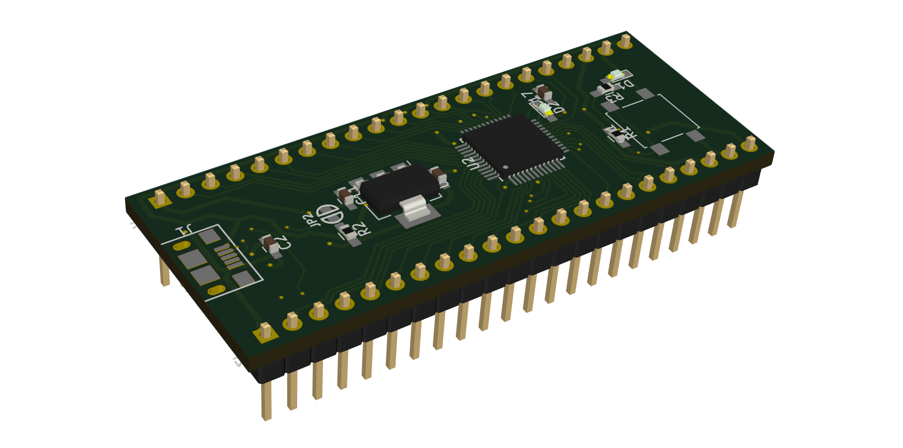

# iceskate


A low cost FPGA development board for absolute newbies.

## Why?
Getting started with FPGA design is hard. Unnecessarily hard.

## How?
Everyone knows how to use a browser. Many people know (some) webdesign.

The [*icerink*](https://github.com/icerink) ecosystem tries to exploit this by building a complete browser centric FPGA workflow. Edit, synthesize and upload FPGA designs from within your browser.

Doing this lowers the boarding hurdle by not requiring the installation of toolchains. Just plug in the board and begin to play :).

## What?
Mainly a FPGA and a USB interface. Not much more. 

The main source of inspiration for this board was the [upduino](http://gnarlygrey.atspace.cc/development-platform.html) by Gnarly Grey. We tried to build a similarly minimal and cheap board. The main Hardware feature, our board employs additionally, is the Microcontroller that is capable of speaking a wide variety of USB-Protocols.

In the *icerink* ecosystem, this capability is used to access the FPGA board from within the browser. 

The iceskate board features:
* The [ICE40UP5K](http://datasheet.octopart.com/ICE40UP5K-SG48ITR50-Lattice-Semiconductor-datasheet-101745901.pdf) FPGA (with experimential support in project icestorm, an open source fpga toolchain)
* An [STM32F070F6P6](http://datasheet.octopart.com/STM32F070F6P6-STMicroelectronics-datasheet-36993117.pdf)
* A single user definable push button and
* A user definable LED

## How to get one?
Build one yourself!

The board is optimized for hand soldering and has a [BOM cost](https://octopart.com/bom-tool/w8mU938s) of ~10€ when you build 10. The PCB can be ordered online at most common PCB manufacturers. We Ordered our boards at jlcpcb. 
[Assembly instructiost can be found here.](https://icerink.github.io/iceskate/)

## Can I help?
Definitely.

If you want to contribute to the hardware design or help with any other thing, do not hesitate to use the issue tracker to get in touch :).

However, it would be nice if you talk to us, **before** you start writing code and invest your time ;).

To develop the board, clone this repository with 
`git clone --recursive https://github.com/icerink/iceskate`.
Then you can simply use Kicad to edit the scematics and PCB.

```diff
- Warning!
- This Project uses submodules! when you clone without --recursive Kicad wont find some libraries!
```
